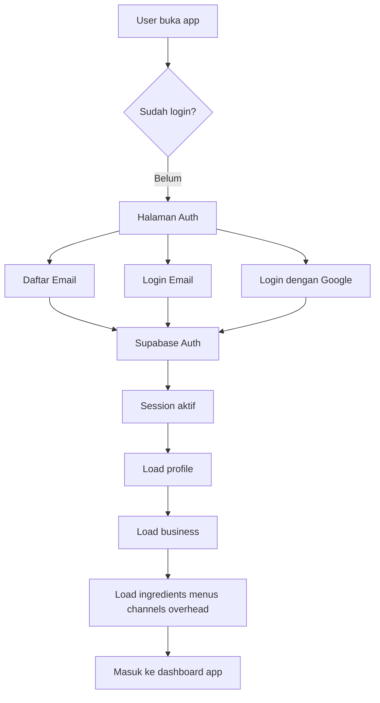

# DapurHitung Auth Flow

Dokumen ini menjelaskan alur login yang disarankan untuk versi user-account:

- daftar/login dengan email
- login dengan Google
- setiap user hanya melihat data miliknya sendiri

## Target versi 1

Model yang dipakai:

- 1 akun = 1 user
- 1 user = 1 bisnis
- tidak ada kolaborasi tim dulu
- data user dipisahkan lewat `user_id` dan `business_id`

## Provider login

### 1. Email/password
Dipakai untuk:
- daftar akun baru
- login akun lama
- reset password

### 2. Google OAuth
Dipakai untuk:
- login cepat
- onboarding lebih singkat

## Flow utama aplikasi

## Detail alur email/password

### Sign up
1. User isi email dan password.
2. Frontend panggil `supabase.auth.signUp()`.
3. Jika email confirmation aktif:
   - user menerima email verifikasi
   - setelah klik link, user kembali ke app
4. Trigger database otomatis membuat:
   - `profiles`
   - `businesses`
   - `channels` default
   - `overheads` default

### Sign in
1. User isi email dan password.
2. Frontend panggil `supabase.auth.signInWithPassword()`.
3. Setelah session aktif, app load semua data milik user.

### Reset password
1. User klik "Lupa password".
2. Frontend panggil `supabase.auth.resetPasswordForEmail()`.
3. User diarahkan ke halaman ubah password.

## Detail alur Google OAuth

1. User klik tombol "Lanjut dengan Google".
2. Frontend panggil `supabase.auth.signInWithOAuth({ provider: 'google' })`.
3. User diarahkan ke consent screen Google.
4. Setelah sukses, user kembali ke URL callback app.
5. Session aktif.
6. Trigger database membuat data default jika user baru pertama kali login.

## Redirect URL yang perlu didaftarkan

### Lokal
- `http://localhost:5173`

### Production Cloudflare Pages
Contoh:
- `https://namaproject.pages.dev`

Jika memakai custom domain nanti:
- `https://app.domainanda.com`

## State di frontend yang perlu ada

Minimal state auth di React:

- `session`
- `user`
- `profile`
- `business`
- `isAuthLoading`
- `isDataLoading`
- `authError`

## Struktur layar yang disarankan

### Sebelum login
- splash / intro singkat
- form email login
- form daftar
- tombol login Google
- tombol lupa password

### Setelah login
- header menampilkan nama user atau nama usaha
- menu utama aplikasi
- tombol logout

## Pengambilan data setelah login

Urutan load yang aman:

1. ambil session
2. ambil `profiles`
3. ambil `businesses`
4. ambil `channels`
5. ambil `overheads`
6. ambil `ingredients`
7. ambil `menus`
8. ambil `menu_items`
9. gabungkan ke bentuk state yang dipakai UI

## Strategi penyimpanan yang direkomendasikan

### Sumber data utama
- Supabase database

### Cache lokal opsional
- `localStorage` atau `IndexedDB`
- hanya untuk cache sementara atau draft offline
- bukan sumber data utama

## Strategi sinkronisasi pertama

Versi 1 cukup pakai strategi sederhana:

- load semua data user saat login
- simpan perubahan ke database per aksi CRUD
- refresh state lokal setelah insert/update/delete

Belum perlu:
- realtime sync
- background conflict resolution
- collaborative editing

## Error handling minimum

Frontend perlu menangani:

- email sudah terdaftar
- password salah
- Google login dibatalkan
- koneksi internet putus
- query data gagal
- session kadaluarsa

## Logout

Saat logout:
1. panggil `supabase.auth.signOut()`
2. hapus state auth di frontend
3. hapus cache lokal yang sensitif jika dipakai
4. kembali ke halaman login

## Keputusan implementasi yang saya sarankan

Untuk app ini, urutan implementasi terbaik:

1. pasang Supabase Auth
2. pasang tabel + RLS
3. bikin halaman auth sederhana
4. load data per user setelah login
5. migrasikan CRUD dari localStorage ke Supabase
6. jadikan localStorage hanya sebagai backup/cache
